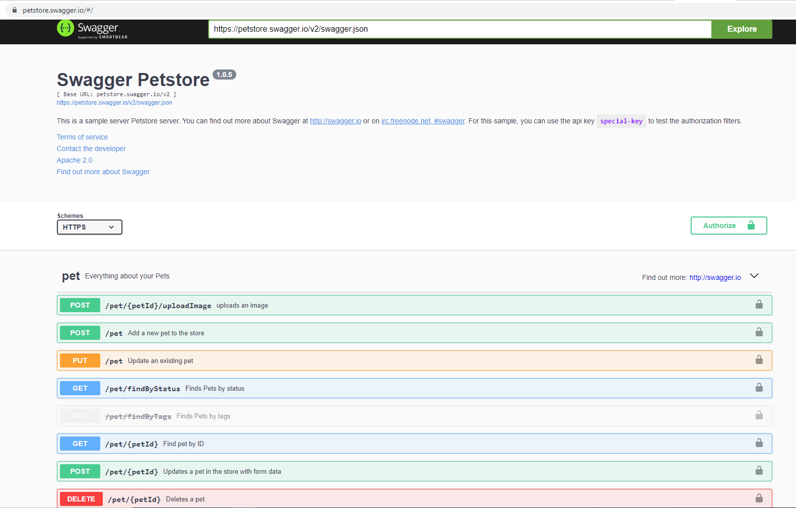
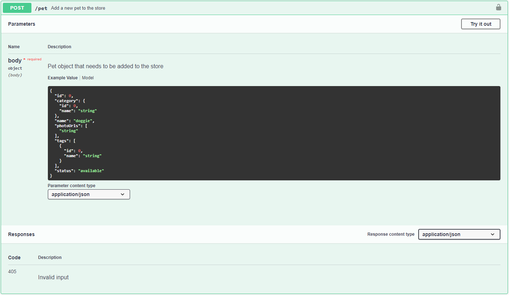
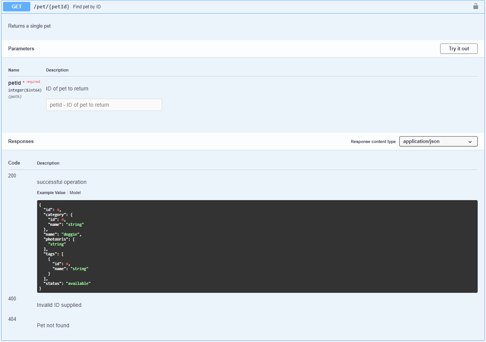
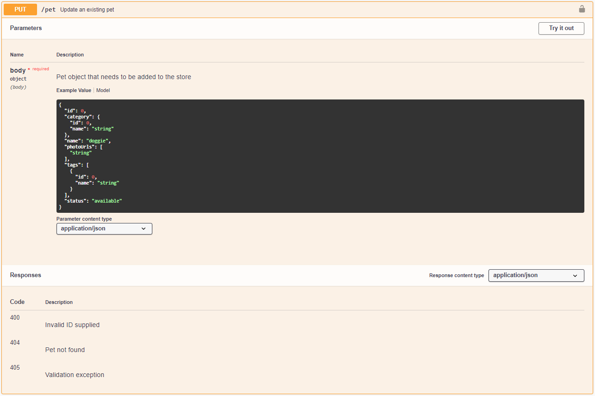
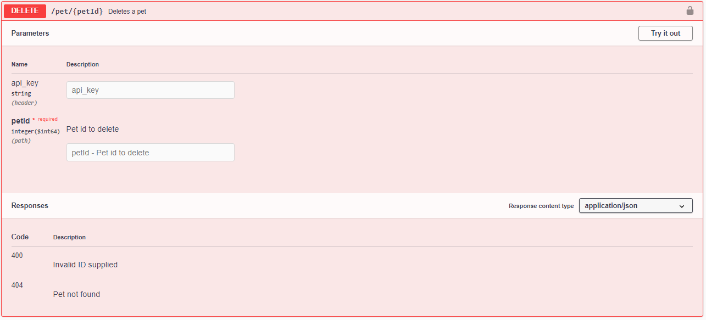

# **Supertest Homework and Instructions**
## **Preconditions**
1. [Node.js](https://rit.accenture.com/ies-confluence/pages/viewpage.action?pageId=65603761#:~:text=Visual%20Studio%20Code.-,Install%20Node.js%3A,-First%20step%20is)/[Mocha](https://rit.accenture.com/ies-confluence/pages/viewpage.action?pageId=65603761#:~:text=Supertest%20configuration.)/[Chai](https://rit.accenture.com/ies-confluence/pages/viewpage.action?pageId=65603761#:~:text=Supertest%20configuration.)/[Babel](https://rit.accenture.com/ies-confluence/pages/viewpage.action?pageId=65603761#:~:text=Supertest%20configuration.)/[Supertest](https://rit.accenture.com/ies-confluence/pages/viewpage.action?pageId=65603761#:~:text=Supertest%20configuration.)/[Git](https://rit.accenture.com/ies-confluence/display/STA/Git+Basics+JavaScript#GitBasicsJavaScript-Selectingtheworkingdirectory) installed and configured
1. [Visual Studio Code](https://rit.accenture.com/ies-confluence/pages/viewpage.action?pageId=65603761#:~:text=Installing%20an%20IDE%2C%20in%20our%20case%20Visual%20Studio%20Code.) is installed
## **Setup local workspace**
1. [Select the working directory](https://rit.accenture.com/ies-confluence/display/STA/Git+Basics#GitBasics-Selectingtheworkingdirectory)
1. [Clone the repository](https://rit.accenture.com/ies-confluence/display/STA/Git+Basics#:~:text=Cloning%20the%20repository) (Repository: <https://rit.accenture.com/gitlab/java_automation/self_study_unresolved_materials/-/tree/SuperTest_HomeWork_Unresolved>)
1. [Checkout your branch](https://rit.accenture.com/ies-confluence/display/STA/Git+Basics#:~:text=Checkout%20the%20feature%20branch)
1. Import the project in to Visual Studio Code
1. Configure project as explained in the [6th video](https://www.youtube.com/watch?v=7cDRqi2G6Nw&list=PL6AdzyjjD5HDR2kNRU2dA1C8ydXRAaaBV&index=6) of the Youtube course.
## **Application under test**
The application under test in this exercise is a RESTful API and you can find the swagger documentation in the location [**https://petstore.swagger.io/#/](https://petstore.swagger.io/#/)**.**

Swagger documentation not only provides information on the each endpoint, it allows you to try out the requests in order to understand how each end point behaves.

## **What tests needs to be implemented?**
For each test case create a different .js file named as the test case itself (e.g. if the test case is "Create pet record" the associated file would be CreatePet.js). 
### **Create Pet record**
1. Create a new pet (a POST call with the url set to https://petstore.swagger.io/v2/pet) 
1. Set the request body to dynamic values, in particular the new pet id must be RANDOM and the status must be put to "available" (the other fields can be left as default).
1. Verify that the status code of the response is 200.
1. Verify that the new pet has the details given previously (id and status).

### **Get details of a given pet**
Create a new pet as before:

1. Create a new pet (a POST call with the url set to <https://petstore.swagger.io/v2/pet>) 
1. Set the request body to dynamic values, in particular the new pet id must be RANDOM and the status must be put to "available" (the other fields can be left as default).
1. Verify that the status code of the response is 200.

Get the details of the newly created pet:

1. Perform a GET request in order to get the details of the previously created pet.
1. Verify that the status code of the response is 200.
1. Verify that the new pet has the details given previously (id and status).

Get the details of a pet that is not available:

1. Perform a GET request in order to get the details of a pet is not available (use the following ids: 121212121345534 and 121212121345535).
1. Verify that the status code of the response is 404.
1. Validate expected retrieval failure response.

### **Update details of a given pet**
Create a new pet as before:

1. Create a new pet (a POST call with the url set to <https://petstore.swagger.io/v2/pet>) 
1. Set the request body to dynamic values, in particular the new pet id must be RANDOM and the status must be put to "available" (the other fields can be left as default).
1. Verify that the status code of the response is 200.

Update the details of the newly created pet:

1. Perform a PUT request in order to update the details of the previously created pet. In particular, put the id to a new randomly generated value and the status to "sold".
1. Verify that the status code of the response is 200.
1. Verify that the new pet has the details previously updated (id and status).

### **Delete Pet record**
Create a new pet as before:

1. Create a new pet (a POST call with the url set to <https://petstore.swagger.io/v2/pet>) 
1. Set the request body to dynamic values, in particular the new pet id must be RANDOM and the status must be put to "available" (the other fields can be left as default).
1. Verify that the status code of the response is 200.

Delete the newly created pet:

1. Perform a DELETE request in order to delete the previously created pet.
1. Verify that the status code of the response is 200.
1. Verify the selected deletion response.

